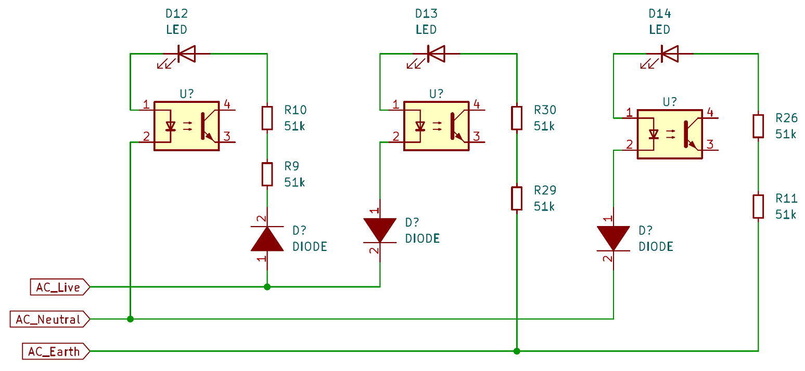

# ht107e-socket-tester-teardown

This repo contains the Kicad schematic files of a teardown of a small portion of the Habotech HT107E socket tester.


## Directory structure

```text
|-- ht107e-sch: Cleaned up schematic
|-- initial-ht107e-teardown: Initial rough schematic work
|-- images: Photos of teardown and device characterisation
|-- datasheets: IC datasheets I could locate online
```

## Kicad schematic



This is the cleaned up schematic showing the minimum amount of components for the indicator LEDs to work with respect to the AC terminals.


This was the initial schematic drawn during the exploration phase.

## Sample teardown photos


Top cover removed


Bottom cover removed


Rear of board


Green LCD backlight